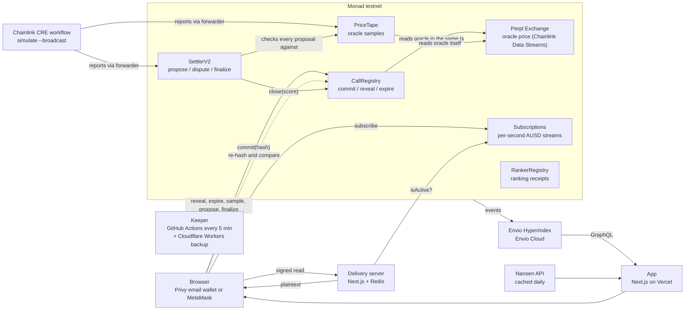
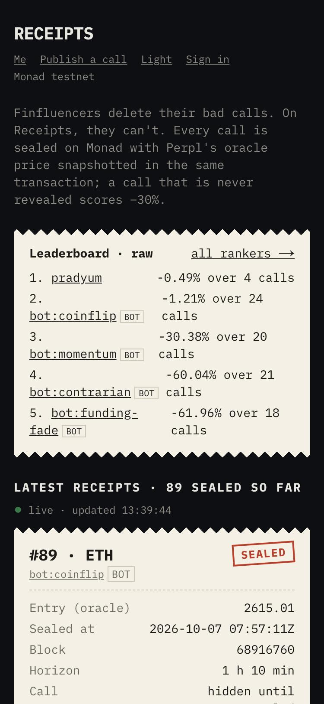
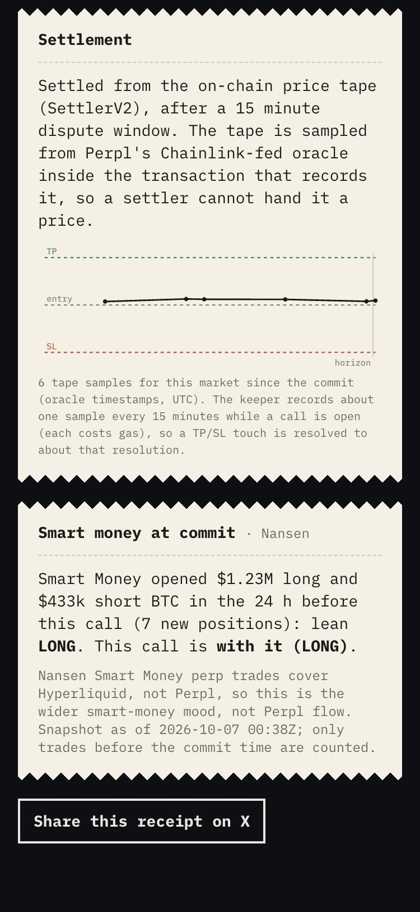
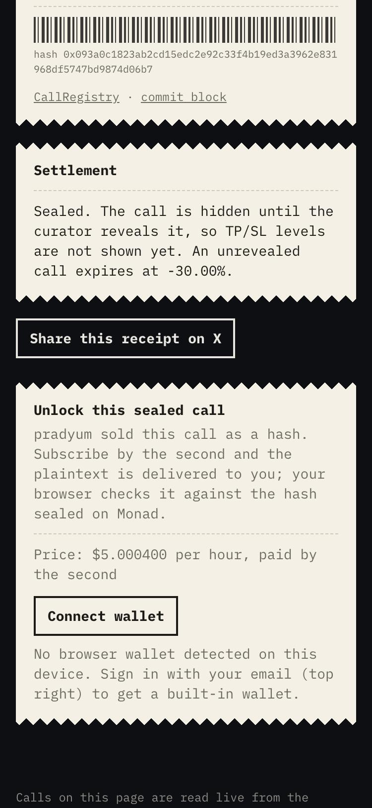
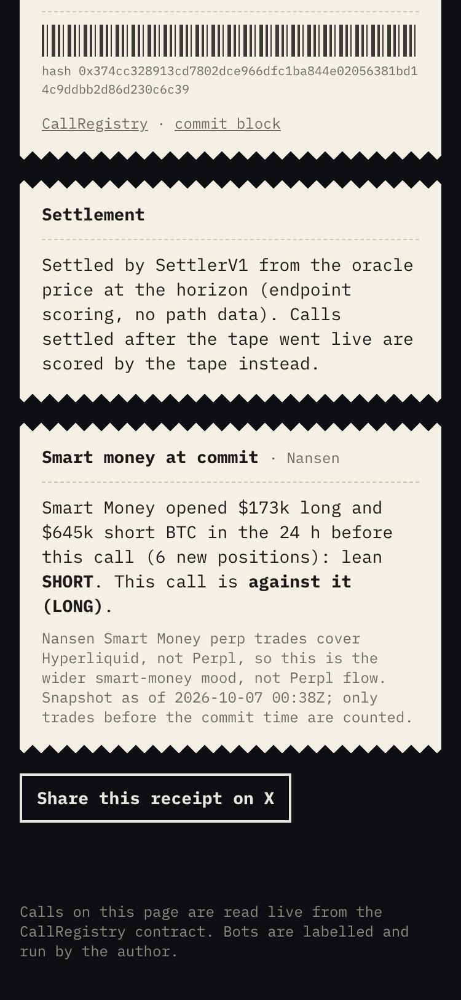
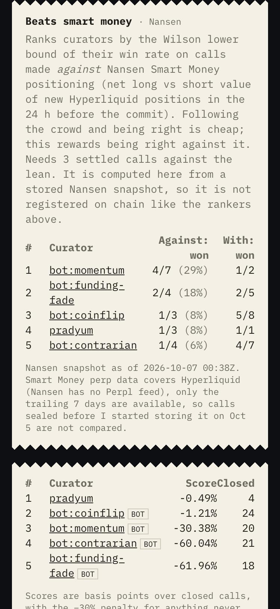
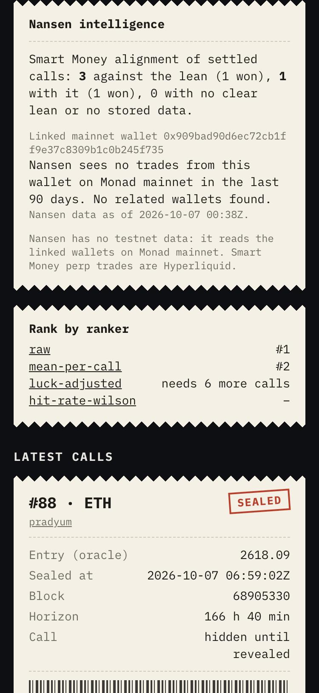
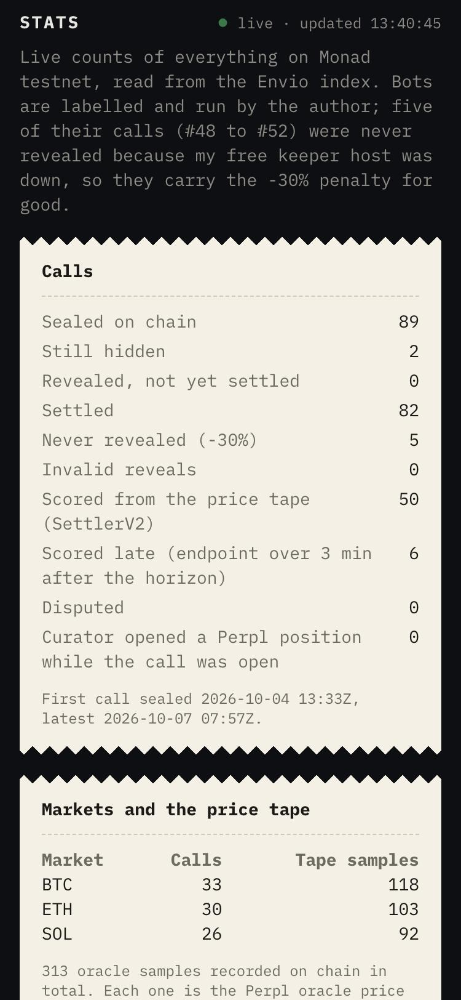

# Receipts

**Finfluencers delete their bad calls. On Receipts, they can't.**

Receipts is a paid curation feed for market calls whose track record cannot be faked. A curator commits a hidden call as a hash on Monad. The same transaction reads Perpl's Chainlink-fed oracle price and stores it as the entry, so the entry price and time cannot be backdated. Subscribers pay by the second, get the plaintext early and check it against the onchain hash in their own browser. Everyone sees the call at the reveal. A call that is never revealed scores -30%, so a bad call cannot be quietly dropped.

**Live app:** [receipts-app-rho-ashy.vercel.app](https://receipts-app-rho-ashy.vercel.app). It reads straight from Monad testnet and an Envio indexer. Built solo for [Monad Metropolis](https://hackathon.monad.xyz) (2026), in the **Social, Attention & Culture** track, with Nansen, Chainlink CRE and Envio as the bounties.

---

## How it works



**The server and the workflow are not trusted for the things that matter.** The delivery server can read a call before the reveal, but it never decides integrity: it refuses plaintext that does not hash to the commit, and the browser re-hashes against the chain. The CRE workflow and the keeper can only trigger true samples and proposals: `PriceTape` reads Perpl's oracle itself inside the transaction, and `SettlerV2` checks every proposal against the tape, where anyone can dispute it with an earlier touching sample for 15 minutes.

---

## Try it

Open https://receipts-app-rho-ashy.vercel.app, press **Sign in** (any email, Privy creates a built-in wallet) or connect MetaMask on Monad testnet, then go to `/me` and press **Get free test money** (0.25 test MON for gas and 200 test dollars; nothing costs real money). Open a receipt marked *Sealed* from the curator `pradyum`, subscribe for ten minutes and press **Sign and unlock**: you get the call and a green "matches sealed commit at block N", computed in your browser. `/call/36` is a bot call settled through the price tape (chart, flags, dispute window), `/rankers` has the open rankers and the Nansen table, `/stats` has live counts from the Envio index, and `/new` publishes your own call.

---

## Screenshots

Taken from the deployed app on a phone-sized screen (real data, nothing staged).

<table>
  <tr>
    <td align="center" width="33%"><br><sub>The feed: a live leaderboard and receipts. Bots are labelled.</sub></td>
    <td align="center" width="33%"><br><sub>A call settled from the on-chain price tape: samples, take profit, stop loss, horizon.</sub></td>
    <td align="center" width="33%"><br><sub>A sealed call: hidden until the reveal, unlocked by subscribing by the second.</sub></td>
  </tr>
  <tr>
    <td align="center"><br><sub>Nansen Smart Money at the moment the call was sealed.</sub></td>
    <td align="center"><br><sub>The "beats smart money" ranking and the open rankers.</sub></td>
    <td align="center"><br><sub>A curator page: alignment with smart money, and the honest empty wallet panel.</sub></td>
  </tr>
  <tr>
    <td align="center"><br><sub>/stats: live counts from the Envio index, checked against the chain.</sub></td>
    <td></td><td></td>
  </tr>
</table>

---

## Who it is for

Right now the users are me and four labelled bots. The people it is built for are small market-call curators: analysts and finfluencers who already post calls on X or Telegram and keep being asked to prove them. Receipts lets them attach a record nobody can edit to calls they already make, and charge by the second for early access instead of selling a flat monthly subscription. Subscribers are people who already pay for market calls and want proof before they pay. Every receipt has a share image generated from chain data, so each curator's calls advertise the product, and the open rankers give curators something to compete on. I have no paying users: this runs on testnet with test money, so the honest claim is that the mechanism works and getting started takes a few minutes.

---

## Why Monad

A track record is only worth reading if every call is on chain, and a feed is only pleasant if sealing a call feels instant. Monad's 300 ms blocks and sub-second finality make a commit land before the curator has looked away, and gas is cheap enough that a bot can seal, reveal and settle dozens of calls a day.

The honest gap: Receipts does not depend on Monad's parallel execution, and I have not measured it. What it uses is fast cheap blocks, the Multicall3 deployment, and the Monad-specific WebSocket subscriptions.

---

## Monad features used

| Feature | How it is used |
|---|---|
| 300 ms blocks, fast finality | The seal tracker on `/new` subscribes to `monadNewHeads` and shows the Proposed, Voted and Finalized stages of the curator's own commit (measured in a browser: about 105 ms, 428 ms and 664 ms) |
| Gas billed on the gas limit | Every keeper transaction uses limit = estimate x 1.15, the CRE report limits are sized from measured costs, and the price tape is sampled only when a call is open (about 0.012 MON per market) |
| Multicall3 at its canonical address | All page reads and the keeper's whole scan go through Multicall3, because the public RPC allows about 15 requests a second |
| Public RPC limits (100-block `eth_getLogs`) | The subscription index is an incremental event scan kept in Redis; the heavy history is Envio's job |
| Monad testnet and mainnet | Contracts, bots and live tests run on testnet (10143); the Envio indexer also reads Perpl on mainnet (143) |

---

## Why Perpl

A call is only worth trusting if its entry price came from somewhere the curator cannot touch. Perpl's exchange already exposes a Chainlink Data Streams price on chain, so reading it inside the commit transaction makes the entry price and time as honest as the oracle.

The honest gap: Receipts reads Perpl but does not trade on it, so I did not enter the Perpl trading-bot bounty.

---

## Perpl features used

| Feature | How it is used |
|---|---|
| `getPerpetualInfo` (oracle price, timestamp, `ignOracle`, decimals) | Read inside `CallRegistry.commit` for the entry snapshot and inside `PriceTape.sample` for the price path. The struct is dynamic and undocumented, so a library decodes it; the commit checks `ignOracle` is false and the price is no more than 120 s old |
| REST market-data candles (`/api/v1/market-data/:id/candles/60/:from-:to`) | The CRE workflow's external API. The gap to the oracle is logged in a `CrossCheck` event and never used for scoring |
| `AccountCreated`, `PositionOpened`, `PositionOpenedV2` events | The Envio indexer links a curator's wallet to its Perpl account and flags Perpl positions opened while their own call was open |
| Testnet and mainnet exchanges, per-network market ids | Testnet BTC 16, ETH 32, SOL 48, MON 64, ZEC 256 (they differ from mainnet and are never mixed) |

---

## Why Chainlink CRE

Settlement needs to read the chain and an outside API and then write a result back, which is exactly the shape of a CRE workflow. I wanted the workflow to be the primary path and the contracts not to trust it, so a bad workflow cannot settle a call wrongly.

The honest gap: the workflow runs as a CLI simulation with `--broadcast`, not as a deployed DON workflow. A Chainlink mentor confirmed that is what this bounty expects. In practice my keeper settles most production calls today, because the workflow only runs when I run it.

---

## Chainlink CRE features used

| Feature | How it is used |
|---|---|
| Cron trigger | Starts a run on a schedule (minimum 30 s) |
| EVM read (`callContract`, Multicall3) | Scans the call registry, the tape and the oracle inside the 15-read quota |
| HTTP client | Calls Perpl's REST API for the market price |
| EVM write (`writeReport`) | Sends samples to `PriceTape` and proposals to `SettlerV2` through the forwarder, using the `monad-testnet` chain selector |
| `cre workflow simulate --broadcast` | Real transactions on Monad testnet. On production it proposed the settlement of call #55 (tx `0x23f21fe5152ea8d9a81f17f276ee930bf25d32954f8eea7c16df42ed52e7475c`), which the keeper then finalized with exactly that score |
| Targets and configs | `local-simulation`, `staging-settings` and `production-settings`, each with its own contract addresses |
| `MockKeystoneForwarder` | The simulation forwarder. It does not verify DON signatures, so the receivers never trust the report's content |

---

## Why Envio

The feed, the leaderboard, curator pages and the rankers all need the whole history of calls, scores, settlements and subscriptions, and reading that from a public RPC that limits log ranges would not work. One GraphQL endpoint solves it for the app and for anyone who wants to rerun a ranker.

The honest gap: the public Envio Cloud endpoint has no aggregate queries, so the app counts on the client. The app also falls back to reading the chain directly if the indexer is down.

---

## Envio features used

| Feature | How it is used |
|---|---|
| HyperIndex on Envio Cloud, multichain | Monad testnet (10143) and mainnet (143); entities are per chain (`disable_default_cross_chain`) |
| Event handlers over 9 contracts | Receipts contracts plus Perpl's Exchange (as two logical contracts at the same address, with different start blocks) |
| 17 derived entities | Curator stats with equity curve and max drawdown, market stats, revenue, settlement proposals, tape samples and cross-checks, ranker receipts, Perpl skin-in-the-game flags |
| Per-contract `start_block` | Keeps the indexer inside the free plan's event budget |
| `chain_metadata` | The app shows "indexed to block N of M", and the live test waits on it |
| `createTestIndexer().process({ simulate })` | 18 fast, deterministic handler tests |
| Live test against Envio Cloud | Pins one block and compares every call, curator stat, market stat and revenue row with a recomputation from contract reads |

---

## Why Nansen

Before paying a curator, a subscriber wants to know if the curator thinks for themselves or follows the crowd. Nansen Smart Money is a ready-made crowd to compare against, and the comparison is only honest if it is made at the moment the call was sealed, not afterwards.

The honest gap: Smart Money perp data covers Hyperliquid, not Perpl, and only the last 7 days. Nansen has no testnet data, so the wallet panels show an empty state for testnet curators.

---

## Nansen features used

| Feature | How it is used |
|---|---|
| Smart Money perp trades (`/api/v1/smart-money/perp-trades`) | Net long or short lean in BTC, ETH and SOL in the 24 hours before each call; the receipt page shows whether the call went with or against it |
| Profiler related wallets (`/api/v1/profiler/address/related-wallets`) | Same-operator cluster flag across curators' linked mainnet wallets |
| Profiler PnL summary (`/api/v1/profiler/address/pnl-summary`) | Realised PnL and win rate of a curator's linked wallet on Monad mainnet |
| Credit-aware design | Free plan (100 credits, then 10 a day): daily cached refresh, "as of" labels, a reserve read from Nansen's own response headers |
| "Beats smart money" ranker | Ranks curators by the Wilson lower bound of their win rate on calls made against the lean |

---

## Why Privy

A feed for people who follow markets should not start with "install a wallet and get gas". Privy lets a visitor sign in with an email and get an embedded wallet; combined with a one-click starter-funds button, someone can subscribe and verify a call in about three minutes.

The honest gap: I use Privy for sign-in and the embedded wallet only. I did not use server wallets or policies, so I did not enter a Privy bounty.

---

## Privy features used

| Feature | How it is used |
|---|---|
| Email login | The only login method (Google would need my own OAuth client) |
| Embedded wallet, created on login | Handed to the app as an EIP-1193 provider through viem's custom transport; every flow (subscribe, unlock, publish, link identity) works the same with MetaMask |
| Coexistence with extension wallets | Signing in or out resets each page's connection so the two wallet types never mix |

---
## Bounty evidence

What each bounty asks for (from the official text on the portal), where this repository meets it, and how to check it.

### Nansen: Best use of Nansen

| Requirement | Where | Verify |
|---|---|---|
| Integrate at least one Nansen endpoint, MCP tool or CLI | Three REST endpoints: Smart Money perp trades, Profiler related wallets, Profiler PnL summary (`app/lib/nansen.ts`). I did not use MCP or the CLI | Table in "Nansen in detail"; `grep -n "api/v1" app/lib/nansen.ts` |
| Part of a core feature, not a data display | On every revealed call: did the curator go with or against smart money when sealing it. It also drives a ranking ("beats smart money") and the same-operator flag on curator pages (`rankers/src/smartMoney.ts`, `clusters.ts`) | Open `/call/19` (LONG against a SHORT lean, won), `/rankers`, `/c/pradyum`; screenshots above |
| Working product with live data | Real Nansen responses stored in Redis with a fetch time, refreshed daily; the snapshot holds the trailing 7 days of Smart Money positions for BTC, ETH and SOL (141 when first filled on Oct 5) | Every panel shows "as of ..."; `/api/nansen/refresh` is the cron that fills it |
| Clear explanation of endpoints, data categories and tools | "Nansen in detail" lists each endpoint, what it is used for and its credit cost; the limits (Hyperliquid only, 7 days, no testnet) are stated | README sections above |
| Public repo or docs | This repository; friction notes in `docs/partner-feedback/nansen.md` | |

### Chainlink: Best workflow with CRE

| Requirement | Where | Verify |
|---|---|---|
| Blockchain plus an external API | The workflow reads the call registry, the tape and Perpl's oracle with EVM reads and calls Perpl's REST market-data API (`cre/tape-and-settle/main.ts`) | The run log shows the REST fetch and the cross-check against the oracle |
| A successful simulation through the CRE CLI | `cre workflow simulate tape-and-settle --target production-settings --broadcast` proposed the settlement of call #55 on production (tx `0x23f21fe5152ea8d9a81f17f276ee930bf25d32954f8eea7c16df42ed52e7475c`); a live test does the same end to end on a staging copy | `cast call 0xBdCF5A34a13617f62FFB9d3155dF3fA2939e73Dc 'proposals(uint256)(uint64,uint32,int32,bool,bool,bool)' 55`; `cd live-tests && DEPLOY_NAME=staging-v2 pnpm exec vitest run test/tape.live.test.ts` |
| CRE used meaningfully as an orchestration layer | A cron trigger, batched EVM reads, an HTTP call and `writeReport` to two receivers; the contracts verify everything the workflow sends | `cre/tape-and-settle/main.ts` (glue) and `logic.ts` (pure decisions, 12 bun tests) |

### Envio: Best use of Envio

| Requirement | Where | Verify |
|---|---|---|
| The indexer drives a feature | The feed, leaderboard, curator pages, rankers page and `/stats` all read it; the app falls back to the chain only if the indexer is down | The pages show "Indexed by Envio ... indexed to block N" |
| Depth: multichain, non-trivial schema, derived entities | Monad testnet and mainnet; 17 entities; derived stats (equity curve, max drawdown, the sums a ranker needs), per-market stats, revenue, and Perpl's own account and position events to flag a curator trading while their call is open | `indexer/config.yaml`, `indexer/schema.graphql`, `indexer/src/handlers/` |
| Deployed on Envio Cloud, live and correct | `https://indexer.dev.hyperindex.xyz/851d538/v1/graphql`; a live test pins one block and compares every call, curator stat, market stat and revenue row with a recomputation from the chain | `cd live-tests && ENVIO_GRAPHQL=https://indexer.dev.hyperindex.xyz/da57fdb/v1/graphql DEPLOY_NAME=production pnpm exec vitest run test/indexer.live.test.ts` |
| Craft: readable code, a repo someone else can pick up | The indexer is its own project with its own README, 18 tests, and a setup guide | `indexer/README.md`; `cd indexer && pnpm test` (Node 22) |

---

## Live on testnet (Monad, chain 10143)

| Contract | Address | Verified |
|---|---|---|
| CuratorRegistry | `0x1e917319c379fd4e62Bf3207379E3d8bb1A468AF` | Sourcify `exact_match` |
| CallRegistry (frozen facts layer) | `0x1E9b6c2e6484CcbeA63F4567905012a28Fa1753C` | Sourcify `exact_match` |
| SettlerV1 (endpoint scoring, approximate) | `0xF39358B88cF73a1d9158f00b9D5E39A04543E03f` | Sourcify `exact_match` |
| Subscriptions (per-second AUSD streams) | `0xcbDFf5C6f618dEA573a4B0FE000AF712F85D661e` | Sourcify `exact_match` |
| PriceTape (oracle samples written via Chainlink CRE) | `0xC028FCBE295bFA67bD1aA17e1f467214cE0Bf814` | Sourcify `exact_match` |
| SettlerV2 (path-aware, disputable; active settler since Oct 5) | `0xBdCF5A34a13617f62FFB9d3155dF3fA2939e73Dc` | Sourcify `exact_match` |
| RankerRegistry (receipts for ranking algorithms) | `0xc1936e5Ce100B7801fffBe99339F1757A3049581` | Sourcify `exact_match` |

Parameters: minimum horizon 15 min, maximum 7 days, take-profit cap 30%, stop-loss cap 15%, unrevealed-call penalty −30%, bond 50 AUSD, oracle age limit 120 s, settler-rotation timelock 6 h. A separate staging deployment (60 s minimum horizon) exists for live tests; its addresses are in `deployments/`.

---

## Subscriptions and delivery

A subscriber deposits AUSD and the curator earns it by the second at the rate the curator set when the stream started. Cancelling refunds exactly the part not yet earned. All math is whole-number multiplication (rate × seconds), so there is no rounding: deposit = paid + refund. Fuzz tests and live tests on testnet check this against an independent recompute from block timestamps.

The plaintext of a sealed call is delivered by a small server (Next.js route handlers backed by Upstash Redis). I want to be plain about what that server is trusted for:

- **It sees the plaintext before reveal.** It is trusted for availability and confidentiality only. A subscriber who does not trust it cannot be protected from it reading the call early; encrypting to subscriber keys is future work.
- **It is never trusted for integrity.** It refuses to store a plaintext that does not hash to the onchain commit, and the browser recomputes the hash itself against the chain and shows "✓ matches sealed commit" or "✗ DOES NOT MATCH". A server that lied would be caught.
- **Reads need a signature.** A sealed call is returned only to a wallet that signs a short message (bound to the call, the deployment and a 5-minute window) and has an active onchain subscription to that curator, or is the curator.
- **The bots' calls are not in the store yet.** Their plaintext can be recomputed from a secret I hold; subscriptions to bots are not offered.

---

## Chainlink CRE in detail: the price tape and SettlerV2

SettlerV1 scores a call at the end only and lets whoever settles pick which post-horizon oracle sample to use. SettlerV2 fixes both with a price tape written by a Chainlink CRE workflow (`cre/tape-and-settle`, TypeScript).

What the workflow does on each run (cron, at most every 30 s):
1. Reads the newest calls, the live Perpl oracle price and the tape state with a few Multicall3 EVM reads.
2. Calls **Perpl's REST API** (an external API) for the last traded price of each market that needs a sample.
3. Writes a report to `PriceTape` only when needed: while a revealed call's take-profit or stop-loss is touched by the live oracle, or when a call's horizon has passed and the tape has no sample after it. On Monad gas is charged on the gas limit, so a continuous tape would cost too much MON.
4. For revealed calls past their horizon whose endpoint is on the tape, finds the first sample that touches take-profit or stop-loss and writes a proposal report to `SettlerV2`.

How I made it trustworthy without trusting the workflow:
- **The tape never believes a price it is handed.** `PriceTape` reads the Perpl Exchange's oracle itself inside the transaction and appends the sample only if it is newer than the last one. A forged report can at most trigger a true sample. The REST price from the workflow is stored only as a `CrossCheck` event with the divergence in basis points, never used for scoring.
- **`SettlerV2` never believes a claim.** A proposal is checked against the tape: a path sample must really touch take-profit or stop-loss, and an endpoint must be the first sample at or after the horizon, so nobody can pick a convenient one. Anyone can dispute with an earlier touching sample during a window (900 s on production); after it, anyone can finalize and the registry closes the call. Every step costs O(1) gas.
- **The keeper is a fallback, not a dependency.** The keeper (GitHub Actions, with Cloudflare Workers as a backup) also records the endpoint sample, proposes and finalizes through the same verified path, so settlement does not need anyone to run the CRE CLI. While a market has an open call it also records a path sample about every 15 minutes (one transaction for all markets that need one), which is what lets a take-profit or stop-loss touch inside the window be found. Monad bills gas on the limit, so this costs real MON: about 0.012 MON per market per sample.

On production, one real CRE run (Oct 6, 15:31 IST) proposed the settlement for call #55 (tx `0x23f21fe5152ea8d9a81f17f276ee930bf25d32954f8eea7c16df42ed52e7475c`, tape sample 44, +4 bps); the keeper finalized it after the 900 s window with exactly that score.

What I tested live on Monad testnet (staging copy with a 60 s window, `live-tests/test/tape.live.test.ts` and `bots/test/live/v2.live.test.ts`): the tape equals the Exchange's oracle (independent raw decode); a forged report from a non-forwarder reverts at both receivers; a wrong proposal is overturned by a dispute; a settlement proposed by the real CRE workflow (`cre workflow simulate --broadcast`) and one finalized by the keeper alone both score exactly what an independent recomputation from the tape gives.

Honest limits:
- **The CRE workflow runs as a CLI simulation with broadcast, not as a deployed workflow.** A Chainlink mentor confirmed that for this bounty a simulation with a video is what is expected, and that deploying to the DON is meant for production clients. The simulation sends real transactions through Chainlink's `MockKeystoneForwarder`, which does not verify DON signatures; this is why nothing in the design depends on authenticating the workflow.
- **Path resolution is the tape's density.** A touch between two samples is invisible, and the first sample at or after the horizon can lag the horizon (flagged when more than 180 s).
- **Calls settled before Oct 5, 21:15 IST were scored by SettlerV1** (endpoint only) and stay final. Since the switch, calls are settled through the tape: the first was #31 (proposed at 21:57 IST, finalized at about 22:12 IST, score +1.00%, flags 4); most calls since then carry flags 4.

---

## Envio in detail: the indexer and the open rankers

`indexer/` is an Envio HyperIndex project covering the Receipts contracts on Monad testnet and Perpl's Exchange on testnet and mainnet (mainnet is a bounded one-day window, Oct 6 to Oct 7, because the free Envio plan limits an indexer to about 100k stored events and live mainnet opens would need about 17k a day; the config supports live indexing). It derives per-curator scoreboards (equity curve, max drawdown, sums for confidence bounds), per-market stats, subscription revenue and daily Perpl analytics, and it flags a curator's own Perpl positions opened while a call was open. I check it against the chain with a live test that pins one block, waits for the indexer to reach it and compares every row (see `indexer/README.md`).

`rankers/` holds the ranking algorithms as pure functions (`raw`, `mean-per-call`, `luck-adjusted`, `hit-rate-wilson`). A ranker is registered on chain with its code location and git commit, so anyone can rerun the exact code. The README there reports a coin-flip simulation, including the case where the luck-adjusted rule does *not* beat plain summing.

---

## Nansen in detail: smart money at the moment of the call

I use Nansen where it answers a question a subscriber actually has: was this curator going with the crowd or against it? For every revealed call, the receipt page shows what Nansen Smart Money was doing in that market in the 24 hours before the call was sealed, and whether the call went with or against that lean. Only trades before the commit time are counted, and a sealed call's direction is never compared (it is secret until reveal). `/rankers` has a "beats smart money" table that ranks curators by the Wilson lower bound of their win rate on calls made *against* the lean, so following the crowd and being right does not rank. Example from production: receipt #19 was LONG when Smart Money had opened about $173k long and $645k short BTC, and it won +0.45%.

**Endpoints I call** (REST, `https://api.nansen.ai`, header `apikey`):

| Endpoint | Used for | Cost I measured |
|---|---|---|
| `POST /api/v1/smart-money/perp-trades` | Smart Money new perp positions for BTC, ETH, SOL (`only_new_positions`, 168 h lookback, one page of 1000) | 5 credits per call |
| `POST /api/v1/profiler/address/related-wallets` (`chain: monad`) | wallets related to a curator's linked identity wallet, for same-operator clusters | 1 credit |
| `POST /api/v1/profiler/address/pnl-summary` (`chain: monad`) | realised PnL and win rate of that wallet on Monad mainnet | read from the `x-nansen-credits-cost` header |

I use the REST API directly. I did not use the Nansen CLI or MCP tools in the product.

**How it is wired**
- `app/lib/nansen.ts` is the only code that calls Nansen. The free plan is 100 credits once, then 10 a day, so pages never call Nansen. A daily Vercel cron (`/api/nansen/refresh`, secret-protected) stores the responses in Redis with the time they were fetched, and every Nansen panel says "as of". The client reads the remaining credits from Nansen's response headers and stops below a reserve of 12.
- The maths is pure and tested: `rankers/src/smartMoney.ts` (lean at a commit time, with/against, the ranker) and `rankers/src/clusters.ts` (same-operator clusters by union-find over shared funders or deployers). 14 of the 38 ranker tests cover these.
- Nansen has no testnet data and the protocol runs on Monad testnet. So a curator can link a **mainnet identity wallet** to their curator address: the wallet signs a message that names the curator (`CuratorRegistry.linkIdentity`, with a replay-proof nonce), so nobody can link a wallet they do not control. The form is on `/me`.

**What is real and what is not.** The Smart Money lean and the "beats smart money" table run on real Nansen data today. The wallet panel and the cluster flag are built, tested and call Nansen for real: I linked one wallet and Nansen answered both calls, with an empty result, because testnet curators have no mainnet history. I will not link wallets to fake a cluster, so those panels show that empty state. Limits that come from Nansen: Smart Money perp data is Hyperliquid only (Perpl is not covered), only the trailing 7 days are available, and I only started storing it on Oct 5, so earlier calls are not compared. Notes on friction are in the partner feedback I wrote while building.

---

## Operating it, and an outage I had

The bots and the keeper must run unattended, because an unrevealed call scores −30% and a revealed call needs someone to settle it. They run as one stateless tick (`bots/scripts/run-once.ts`): a GitHub Actions job is the primary runner, and the same tick runs on two Cloudflare Workers (cron, free plan) as a backup. GitHub's own `schedule` trigger never fired for a brand-new workflow (over two hours), so a third tiny Worker, `bots/src/dispatch.ts`, starts the Actions job every 5 minutes with one authenticated API call (about 1 ms of CPU). Ticks are idempotent, so racing runners is harmless.

**The Cloudflare Free plan failed me twice.** On Oct 4 (about 2 h) and on Oct 6 from 08:10 to 12:55 IST both Workers returned `exceededResources` and then `scriptThrewException` until they recovered. Cloudflare's own analytics showed why: each run used 40 to 60 ms of CPU against the Free plan's 10 ms limit, which is tolerated until it is not. The second outage cost five bot calls (#48 to #52) that were never revealed and expired at −30%, permanently, because the registry is frozen. That is the penalty working as designed, and it is also visible in the bots' stats. I moved the primary runner to GitHub Actions the same day. The record is in `.github/workflows/keeper.yml`.

---

## Measured on testnet

Numbers from my own runs (one machine, public RPC), not benchmarks.

| What | Measured |
|---|---|
| A commit seals (Proposed, Voted, Finalized stages shown on `/new`) | about 0.1 s, 0.4 s and 0.7 s in one browser run |
| "Get free test money": two transactions confirmed by the server | 3.8 s and 5.1 s (two runs) |
| Subscribe, signed unlock, hash check, plus tamper and replay checks | 3.6 s in the live delivery test |
| Receipt page, warm | 0.4 to 0.5 s |
| A CRE workflow run (compile and simulate) | about 4 s |
| After a horizon ends: first sample and proposal | about 1.5 minutes (call #31: horizon 21:56 IST, proposed 21:57 IST) |
| Proposal to settled | 15 minute dispute window, then the next keeper tick; call #31 was finalized about 16 minutes after its horizon |
| Price tape | one oracle sample about every 15 minutes per market while a call is open; 313 samples recorded so far |

---

## What a transaction costs

Gas on Monad is billed on the gas limit, not on gas used. These are medians from the Foundry unit tests (mock exchange); the keeper sends limit = estimate × 1.15, so a real transaction costs about 15% more. MON price column: gas × 102 gwei (the testnet price on Oct 6).

| Action | Gas (median) | ≈ MON |
|---|---|---|
| `commit` (oracle snapshot included) | 273,000 | 0.028 |
| `reveal` | 41,000 | 0.004 |
| `expire` | 49,000 | 0.005 |
| `settle` (SettlerV1) | 145,000 | 0.015 |
| `PriceTape.sample` (one market) | 118,000 | 0.012 |
| `propose` (SettlerV2) | 85,000 | 0.009 |
| `dispute` | 62,000 | 0.006 |
| `finalize` | 64,000 | 0.007 |
| `subscribe` | 120,000 | 0.012 |
| `cancel` | 58,000 | 0.006 |
| `claim` | 50,000 | 0.005 |

Keeping the tape dense (one sample about every 15 minutes for each market that has an open call) costs roughly 3 to 5 MON a day at the current call volume, which is why the keeper only does it while a call is open and only when its own balance is above 1 MON.

---

## Tests, and what they caught

| Suite | Count |
|---|---|
| Contract unit tests (Foundry, with fuzz tests and mutation checks on Subscriptions and SettlerV2) | 135 |
| Fork tests against the real Perpl Exchange | 11 |
| Bots unit tests (tick order, V2 keeper, path sampling) | 42 |
| Rankers (including a drift test: the app's copy of the rankers equals `rankers/src`) | 38 |
| Indexer (scoring maths and handlers with simulated events) | 18 |
| CRE workflow logic (bun) | 12 |
| Live tests that send real transactions on Monad testnet (13 core contracts, 4 subscriptions, 4 delivery API, 4 price tape and real CRE workflow, 2 keeper fallback, 2 human curators, 2 indexer vs chain) | 31, full output in `live-tests/results/2026-10-06.txt` |

Every claim in this README that says "tested live" means a real transaction and a read-back, not a mock. What they caught, in the order I found it:
- **Truncated market id (freeze review).** `Call.perpId` is a `uint32` but the allowlist accepted any `uint256`, so a large id would have truncated on commit and stuck a curator's slot and bond forever. Fixed with a guard and a test.
- **Instant settler swap (freeze review).** The owner could replace the settler at once. Now timelocked (6 hours) and `Ownable2Step`; live-tested.
- **The keeper ignored human curators.** My first real call (#19) would never have been settled, because the keeper only watched the bots' calls. Found by using the product; fixed with a sweep of the newest calls and a live test with a fresh wallet.
- **Public RPC rate limit.** A parallel scan of 12 reads hit "requests limited to 15/sec" and failed 4 of 5 live tests. Replaced with one Multicall3 call.
- **First CRE broadcast cost 0.08 MON** because I guessed an 800,000 gas limit. Limits are now sized from measured gas, since Monad bills the limit.
- **Starter funds reverted** on the first live call: 70,000 gas is not enough for a first-time token recipient (72,918 needed).
- **Fork tests were flaky** because the Agora faucet allows one request per 60 s for everybody; 2 of 11 failed when someone else had just used it.
- **Indexer details**: a contract cannot start before its chain's start block; simulated events below a start block are dropped; a schema change silently lost entity data until the indexer was stopped and restarted. A live test now compares every indexed row with the chain.
- **Cloudflare Free plan outages** (Oct 4 and Oct 6), described above.

---

## Bugs and friction I found in sponsor tooling

I log every rough edge as it happens, with the exact error text, and I worked around each one. The full logs, one file per sponsor, are in [`docs/partner-feedback/`](docs/partner-feedback). The ones most worth fixing upstream:

| Sponsor | What I found | What I did |
|---|---|---|
| Chainlink CRE | `zod .url()` fails in the workflow's QuickJS config parser with a misleading error (`Invalid url` for a valid https URL) because the runtime has no `URL` global (reported: chainlink-agent-skills#86) | Replaced it with a regex |
| Chainlink CRE | Monad is missing from the CRE skill's chain-selector tables, and its fallback mock forwarder is the wrong contract on Monad (reported: chainlink-agent-skills#85) | Took the selector and forwarders from the live directory |
| Chainlink CRE | `--broadcast` bills the full gas limit on Monad; a guessed 800,000 limit cost 0.0816 MON for a ~120k operation | Sized every report from measured gas |
| Chainlink CRE | Transient `unable to retrieve organization info` error suggests a broken account; a retry 20 s later worked | Documented |
| Envio | `envio init` fails on pnpm 12 (`ERR_PNPM_IGNORED_BUILDS` for esbuild), leaving a half-initialised project (already fixed upstream, hyperindex#1679) | Allowed the build script in the project's own workspace file |
| Envio | A contract cannot start before its chain (`start block ... less than the chain start block`), raised at run time and not by `codegen` | Chain `start_block: 0` plus explicit per-contract starts, and two logical contracts on one address |
| Envio | Resuming after a schema change silently loses entity data (queries return 0 rows) | `envio stop` then `envio dev`; a warning would prevent the confusion |
| Envio | The public cloud endpoint has no `_aggregate` queries, unlike the local one | Count on the client |
| Perpl | `getPerpetualInfo` returns an undocumented dynamic struct; the api-docs README lists an outdated testnet collateral token (reported: api-docs#17) | Decode the words by hand; use the token the testnet API reports |
| Nansen | Free tier is 100 credits then 10 a day, and the credit cost per endpoint is only in a response header | Cached everything with "as of" labels and a reserve read from the header |
| Nansen | Smart Money perp data covers only Hyperliquid and the last 7 days, with no date parameter | Labelled on every panel; snapshots stored from Oct 5 |
| Agora | The testnet AUSD faucet's 60 s limit is global, not per address, so a fork test reverted when anyone else had just used it | Warp the fork clock for the faucet call |
| Monad / Cloudflare | Gas billed on the limit makes receipts hide real consumption; a Cloudflare cron on a Worker with `workers_dev = false` never fires, with no warning | Sized limits from estimates; set `workers_dev = true` |
| Privy | A viem-only app pulls in a large WalletConnect tree: pnpm 12 refused the install scripts and `pnpm audit` found 4 transitive advisories | Reviewed the scripts, pinned the advisories with overrides |

---

## Upstream reports

I filed what I could verify as a real problem, after checking the latest upstream version and searching for duplicates:

| Where | Issue | What it is |
|---|---|---|
| Chainlink agent skills | [chainlink-agent-skills#85](https://github.com/smartcontractkit/chainlink-agent-skills/issues/85) | The CRE skill's chain table has no Monad rows, and its fallback mock forwarder is the wrong contract on Monad testnet |
| Chainlink agent skills | [chainlink-agent-skills#86](https://github.com/smartcontractkit/chainlink-agent-skills/issues/86) | The skill lists `zod` as compatible, but `z.string().url()` fails in the workflow runtime because there is no `URL` global |
| Perpl | [api-docs#17](https://github.com/PerplFoundation/api-docs/issues/17) | The README and `.env.example` list a testnet collateral token that the testnet API, perpl-docs and dex-sdk no longer use |

One more thing I hit, `envio init` failing on pnpm 12, was already reported and fixed upstream when I checked ([hyperindex#1679](https://github.com/enviodev/hyperindex/issues/1679)), so I did not file it. The other rough edges in the table above are written up in `docs/partner-feedback/` but I did not file them, because I could not show them to be bugs rather than limits (for example Envio's start-block check, which is a deliberate "not supported yet" error).

---

## Known limitations

- **The delivery server sees the plaintext before the reveal.** It is trusted for availability and confidentiality only; encrypting to subscriber keys is future work.
- **Testnet only.** The cross-chain "pay from any chain" flow on mainnet is not built.
- **The bond is not slashed in this version**, and the exchange address is immutable in `CallRegistry`.
- **The CRE workflow is a simulation with broadcast**, and the mock forwarder does not authenticate it, which is why nothing depends on that.
- **Path resolution is the tape's density** (about one sample per 15 minutes while a call is open).
- **The wallet and cluster panels from Nansen show an empty state** because testnet curators have no mainnet history.
- **Five bot calls (#48 to #52) carry -30% for good** after my free keeper host went down for four hours; the registry is frozen.

---

## Stack

Solidity 0.8.28 with Foundry (OpenZeppelin), TypeScript and viem, Next.js 16 and Tailwind on Vercel, Upstash Redis, Privy, Chainlink CRE (TypeScript SDK), Envio HyperIndex, Nansen API, Cloudflare Workers and GitHub Actions for the keeper, pnpm workspaces.

---
## Layout

| Path | Purpose |
|---|---|
| `contracts/` | Foundry project: registries, settlers, subscriptions |
| `bots/` | Labelled algorithmic curators and the reveal/settle keeper |
| `cre/` | Chainlink CRE workflow |
| `indexer/` | Envio HyperIndex |
| `rankers/` | Open ranker algorithms |
| `app/` | Next.js frontend |
| `live-tests/` | Tests that run against real Monad testnet state, and their saved output |
| `docs/partner-feedback/` | Bugs and friction found in sponsor tooling, one file per sponsor |
| `.github/workflows/` | The keeper job (one stateless tick, started every 5 minutes) |

## Setup

```bash
cp .env.example .env        # fill in your own keys
cd contracts && forge install foundry-rs/forge-std OpenZeppelin/openzeppelin-contracts && forge build
forge test --no-match-path 'test/fork/*'          # unit tests
cd ../app && pnpm install && pnpm dev               # needs KV_REST_API_URL / KV_REST_API_TOKEN (Upstash) for the delivery API
```

## Pre-existing code

None. This repository's first commit is dated Oct 4, 2026 and everything in it was written for Monad Metropolis; the full commit history is the record.

## Use of AI

AI tools played a helpful role in building Receipts, from researching the Perpl, Chainlink CRE, Nansen, Envio and Aurora integration paths to drafting documentation, assisting with contract structure, creating unit tests, and supporting frontend development.

## License

MIT, see `LICENSE`.
